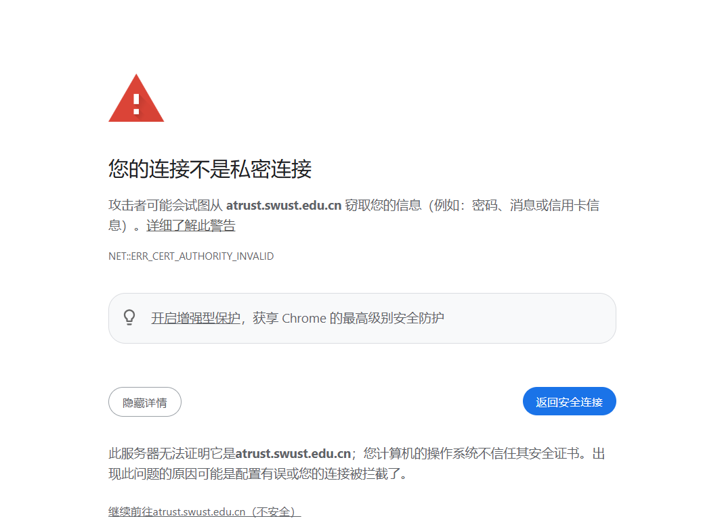

1.	下载一个钉钉，用高考时预留的手机号注册登录钉钉，不出意外的话会被系统或者辅导员拉进专业群或者班级群，第一时间加入新生手册内的所在专业群聊，有问题可以在新生手册里面联系你的辅导员。钉钉群主要用于日常信息沟通，务必保持在线。
2.	同时登录学校一站式服务大厅（现为微信扫码登录，原密码已失效），用高考时预留的手机号注册绑定，学校网站、选课、教务等系统的一站式认证都在这里，和钉钉两者都要用。
3.访问[学校atrust](https://atrust.swust.edu.cn/)（零信任客户端）。**学校目前尚未导入新生信息，等学校通知后再分别下载手机版和电脑版，安装后填写 atrust.swust.edu.cn 即可；安装前关闭电脑 IPv6**。提示证书不安全可点击详情并点击继续访问。

参考视频：[西南科技大学Atrust使用指南-哔哩哔哩](https://b23.tv/iMiqr60)（备注：内容有点过时，但不影响最终效果）

> 提示：学校在开学之后会安排专门的讲座教授 aTrust 等校园系统的使用方法，建议新生留意辅导员 / 钉钉群通知按时参加。
