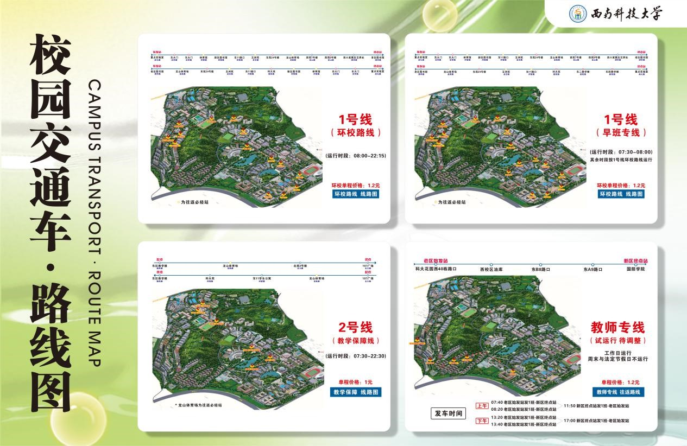

因为学校面积巨大，新生进入容易晕头转向，个人建议使用百度地图进行校内导航，学校现有西科小白龙作为校内交通工具以及校园巴士作为跨校区交通手段，校内小白龙的路线及发车时间如下图：
注：西山校区仅有免费的校区通勤车，无小白龙

坐小白龙小提示：乘坐小白龙需要绑定校园电话卡，否则刷不了卡。如果一时办不好，可以向旁边的同学求助。建议提前熟悉一下路线图，避免上错车。

> 提示参考自小红书博主「每周都有星期一」的《西南科技大学新生齐民要术》，在此致谢。