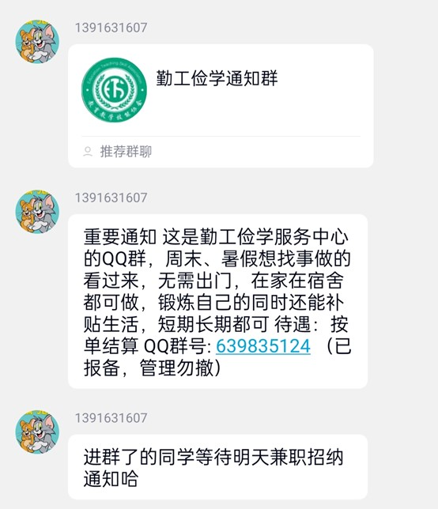
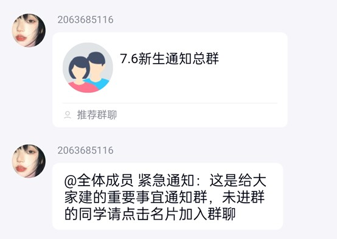

提防兼职陷阱
长期以来，一直有一个非官方团伙假借学校勤工部名义宣传第三方兼职群，这些第三方群未经过学校审核，可能存在克扣工资等行为，案例如下:

一切以该模版及类似话术推广的勤工群皆不是官方勤工群。西科大拥有官方勤工群，群号为:883085554，里面的工作都已向学校报备并通过审查，可以充分保证工资发放，同时学工系统也会不定期提供勤工工作。

提防非官方通知群:
新生在入学前可靠的信息获取渠道只有学院官方新生群，导员和导生，其他非官方渠道的信息无法保证真实性以及可靠性，比如少部分商业团体假借官方新生群名义推广自身产品，请各位新生同学擦亮眼睛。

不要同意来历不明的好友申请:目前极少数推销团伙为了提高推销收益开始通过精确查找的方式进行推销，如果您遇到了来历不明的好友申请请勿通过并拉黑有关人员，切莫随意同意请求。

谨慎办理学校手机卡：办卡相关内容（套路分析、真实案例、校园网络说明）已整合到[谨慎办理学校手机卡](./谨慎办理学校手机卡)，请前往查看。

关于推销：这里的推销主要有两种，一种是校外人员混入学校，以专业实习的名义向学生推销笔，这种推销主要存在的问题是以次充好，价格虚高以及数量不足，个人建议不要购买，另一种是进入寝室进行推销，包括买手机卡以及推销物品，这种建议将推销人员驱逐出寝室并报告宿管阿姨，防范方法是不随意回应敲门，只有在确认人员为学校工作人员之后再开门。