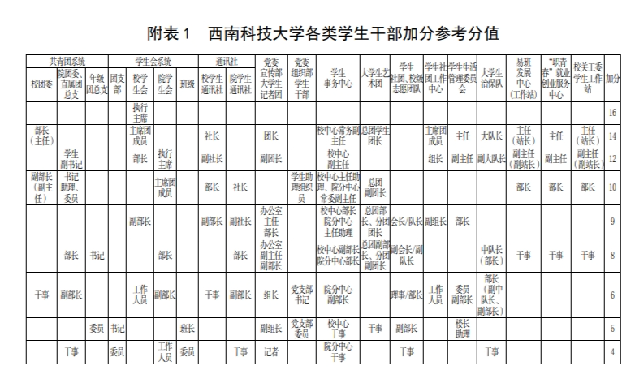

西科大的部门种类多样，各有分工，部门可以分为校级部门和院级部门，忙碌程度也各不相同，同时还拥有各类社团可供选择，部门工作没有工资，但是可以学到知识，提升能力，评综测时还会获得综测加分。具体细则如图：

当然学校也有80多个社团可供选择，社团也有干事和会员之分，你可以选择成为干事参与所在社团的管理，也可以成为会员参与社团的各类活动。每年在107广场举办的百团大战是西科大难得的风景，值得新生一去。
西山校区的童鞋注意：西山校区只有住在西山校区的学院的院级部门专门招新，如果你想参加校级部门需要提前确定招新时间避免错过。