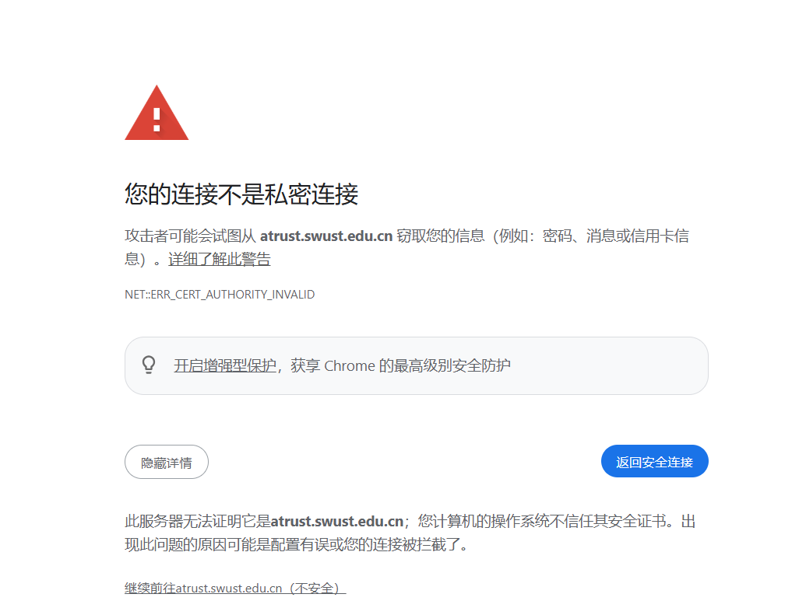

1.	下载一个钉钉，用高考时预留的手机号注册登录钉钉，不出意外的话会被系统或者辅导员拉进专业群或者班级群，有问题可以在新生手册里面联系你的辅导员。
2.	激活一张随录取通知书递送的银行卡（可选）
PS:如果农行卡无法正常激活，就先重置密码，然后再激活，当年我激活农行卡的时候就遇到过默认密码错误的情况。
3.访问[学校atrust](https://atrust.swust.edu.cn/)，提示证书不安全可点击详情并点击继续访问

分别下载手机版和电脑版，安装后页面填写atrust.swust.edu.cn即可。电脑版建议虚拟机使用（安了卸载不了？）并关闭电脑ipv6